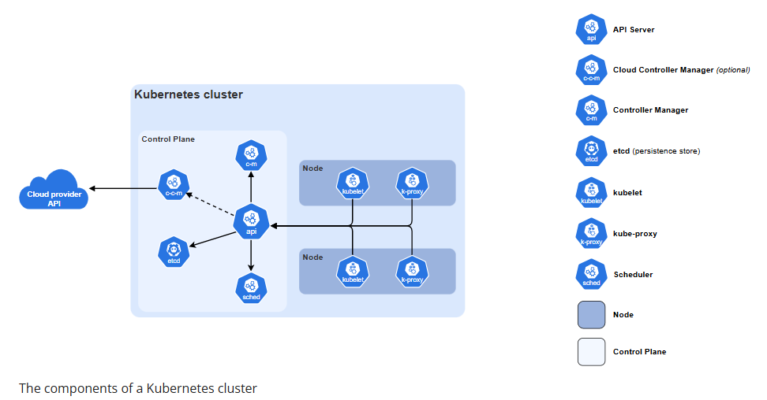
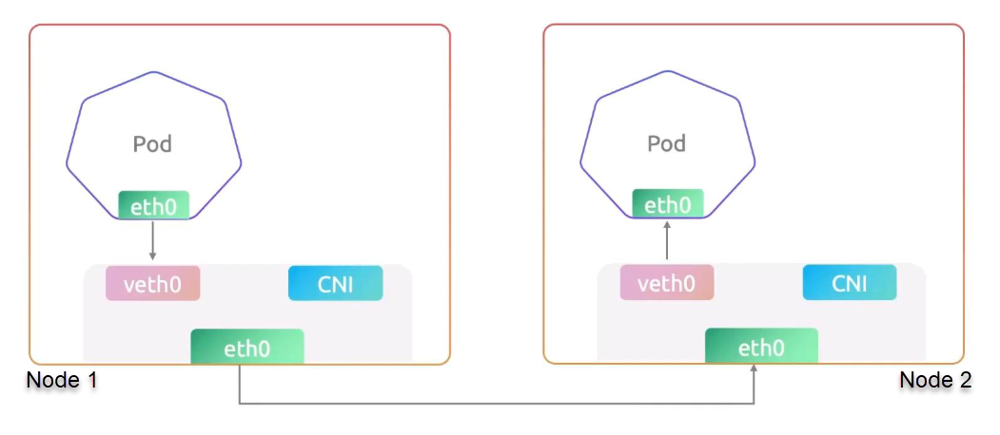

# Kubernetes Introduction

## Kubernetes Architecture Diagram

## How the pod to pod communication happens in the cluster? Through worker nodes itself? Or though Control plane?

1. Traffic goes directly node-to-node.
2. The control plane is NOT involved.
3. CNI plugin (Container Network Interface) handles network traffic routing here.

So, Pod-to-Pod traffic between nodes flows directly over the node network via the CNI, not through the control plane.

